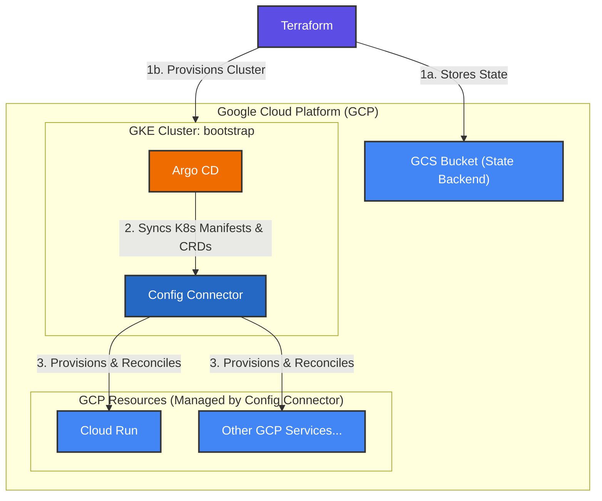

# gcp-playground

GCP playground for myself.

This repository mainly store code or scripts for terraform, k8s, etc.

## requirements

- Docker Desktop
- VSCode & Dev Container Extension

※Or, codespaces.

## architecture



## setup

1. Install tools.
    ```
    $ mise i
    ```

1. Initialize gcloud.
    ```
    # Choose project="playground-502010", region="asia-northeast1-a"
    $ mise run init
    ```

1. Authorization.
    ```
    $ mise run auth
    $ mise run appauth
    ```

1. Prepare a GCS bucket for tfstate files. See [backend](./terraform/backend/).

1. Prepare a GKE cluster for argocd. See [bootstrap](./terraform/bootstrap/).

1. Initialize argocd for GitOps. See [argocd](./argocd/).

## clean up

1. Destroy the cluster for argocd. See [bootstrap](./terraform/bootstrap/).

1. Finally, destroy the backend bucket. See [backend](./terraform/backend/).